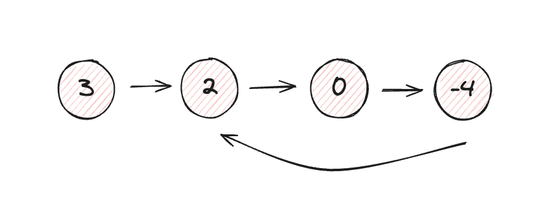

# [Linked List Cycle](https://leetcode.com/problems/linked-list-cycle/description/)

**Problem Description:**  
Given head, the head of a linked list, determine if the linked list has a cycle in it.

There is a cycle in a linked list if there is some node in the list that can be reached again by continuously following the `next` pointer. Internally, `pos` is used to denote the index of the node that tail's `next` pointer is connected to. Note that `pos` is not passed as a parameter.

Return true if there is a cycle in the linked list. Otherwise, return false.

**Difficulty:** `Easy`   
**Category:** `Linked List`, `Cycle detection`

**Example Input/Output:**  

**Input:** `head = [3, 2, 0, -4]` with a cycle at position 1  
**Output:** `true`  
**Explanation:** The linked list has a cycle, as the last node points back to the second node.  

---

### Solution 1: Using a Set  

This approach uses a set to track all the visited nodes. As we traverse the linked list:  
- Check ff a node is already in the set, if yes it means that a cycle is present and we return `true`.  
- If we reach the end of the list (`None`) after adding every elements in the set, it means that there is no duplicate element and here there is no cycle, and we return `false`.  

*Time Complexity:* `O(n)` – We visit each node at most once.  
*Space Complexity:* `O(n)` – We store up to `n` nodes in the set.  

---

### Solution 2: Floyd's Cycle Detection Algorithm (Tortoise and Hare Algorithm) - (Optimal Approach)  

This optimal approach uses two pointers to detect a cycle:  
- A slow pointer (`tortoise`) moves one step at a time.  
- A fast pointer (`hare`) moves two steps at a time.  
- If there is a cycle, the two pointers will eventually meet.  
- If there is no cycle, the fast pointer will reach the end of the list (`None`).

  

*Time Complexity:* `O(n)` – Both pointers traverse the list at most once.  
*Space Complexity:* `O(1)` – No additional data structures are used.  
